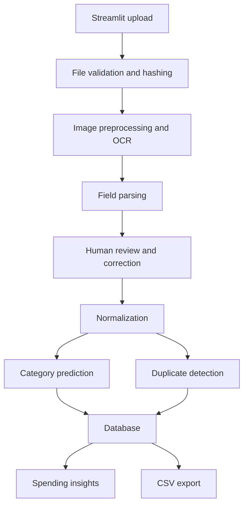

# Planned Architecture

This document describes the planned LedgerLens architecture. It is a planning document, not a description of implemented features.

## MVP Components

### Streamlit Upload Interface

Provides a simple UI for uploading PDF, JPG, or PNG invoices and reviewing extracted expense data. The interface should make correction part of the normal workflow, not an afterthought.

### File Validation and Hashing

Checks file type and basic file safety before processing. Generates file hashes so exact duplicates can be detected even before OCR or field parsing.

### Image Preprocessing and OCR

Prepares uploaded documents for OCR, then extracts raw text. This layer may handle image conversion, page handling, rotation correction, and basic cleanup as the project matures.

### Field Parsing

Turns OCR output into structured candidate fields such as vendor, invoice number, invoice date, subtotal, tax, total, and currency. Early versions may combine simple rules, regular expressions, and dataset-specific mapping decisions.

### Human Review and Correction

Shows extracted candidate values to the user before saving. The reviewed values become the trusted expense record.

### Normalization

Converts reviewed values into consistent formats, such as normalized dates, numeric amounts, currency codes, and cleaned vendor names.

### Category Prediction

Suggests an expense category using a simple baseline first, then a scikit-learn model after enough reviewed examples or labeled data are available.

### Duplicate Detection

Checks for exact file duplicates, exact normalized-field duplicates, and possible near-duplicates based on field similarity.

### Database

Stores reviewed expense records, document metadata, duplicate signals, and category predictions. PostgreSQL is planned for the MVP persistence layer.

### Spending Insights

Displays simple summaries such as spending by vendor, category, month, and currency after reviewed records have been saved.

## Planned Data Flow

```text
Streamlit upload
-> file validation and hashing
-> image preprocessing and OCR
-> field parsing
-> human review and correction
-> normalization
-> category prediction
-> duplicate detection
-> database
-> spending insights
```



Human review sits between extraction and saving. Automated OCR, parsing, category prediction, and duplicate detection should produce suggestions and warnings, not final unchecked records.

## Technology Choices

Python is the main language because it has strong support for OCR workflows, data processing, machine learning, and scripting.

Streamlit is planned for the MVP UI because it is fast to build and suitable for review-focused internal tools.

OCR tools will be used to convert uploaded invoices into text that can be parsed into candidate fields.

scikit-learn is planned for category prediction because it is approachable, well documented, and appropriate for baseline classification models.

PostgreSQL is planned for persistence because it supports structured records, queries for insights, and realistic local development.

## Later Learning Extensions

These tools are learning extensions and should not be treated as MVP requirements:

- MLflow for category-model experiments.
- Airflow for scheduled batch workflows.
- PySpark for batch transformations and aggregations.
- Docker for reproducible local services.
- GitHub Actions for CI/CD.
- Databricks for one Spark learning exercise.
- AWS SageMaker for one optional cloud training experiment.

The MVP should work as a small, understandable application before these extensions are added.
